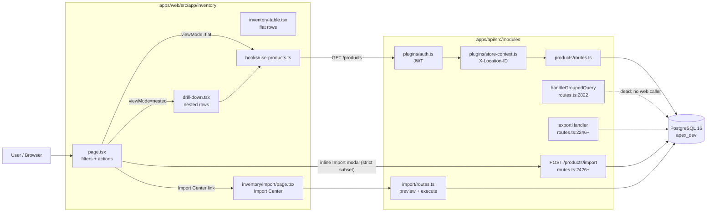

# Item List Page — Full Audit

**Date:** 2026-04-16
**Scope:** `/inventory` page end-to-end (web UI, API, shared types, schema)
**Mode:** Read-only audit. No code changed in this pass.
**Dataset reference:** ~43,599 products across multiple locations.
**Status of verification items:** NV-1, NV-2, NV-3, NV-7, NV-8 verified during audit. NV-4, NV-5, NV-6, NV-9, NV-10, NV-11 include exact commands for the user to run before Phase 1 kickoff.

---

## 1. Files Reviewed

| Path | Purpose | LOC (approx) |
|---|---|---|
| `apps/web/src/app/inventory/page.tsx` | Top-level Item List page — filters, search, view-mode toggle, header actions, bulk toolbar | ~1969 |
| `apps/web/src/app/inventory/components/inventory-table.tsx` | Flat-view table render, row coloring, sell/cost columns | ~1500 |
| `apps/web/src/app/inventory/components/drill-down.tsx` | Family-grouped nested view | ~1040 |
| `apps/web/src/app/inventory/lib/inventory-utils.ts` | `getStockStatus`, `getMarginPercent`, `formatPrice`, `getVariantDescriptor`, `PAGE_SIZES` | 31 |
| `apps/web/src/hooks/use-products.ts` | React-Query wrapper for `GET /products`, `grouped` flag accepted but unused | ~200 |
| `apps/web/src/app/inventory/import/page.tsx` | Import Center top-level page | n/a |
| `apps/api/src/modules/products/routes.ts` | Products module — list, grouped query, export, import, bulk update, find&replace, patch | ~3449 |
| `apps/api/src/modules/import/routes.ts` | Import Center routes (preview / execute) | ~267 |
| `apps/api/src/modules/import/service.ts` | Import Center service — mode selector, mapping | — |
| `apps/api/src/modules/stock-monitor/service.ts` | Canonical cost pattern via `COALESCE(NULLIF(current_cost_price,'0.00'), NULLIF(cost_price,'0.00'))` | — |
| `packages/database/src/schema/products.ts` | Products table definition, indexes | — |
| `packages/database/migrations/0026_taxonomy_and_variants.sql` | `idx_products_parent_id` creation | — |
| `packages/types/src/schemas.ts` | Shared Zod schemas (`updateProductSchema`, `bulkImportSchema`) | — |
| `packages/types/src/mnemonic.ts` | KINGSCOBRA cost mnemonic | — |
| `packages/types/src/zpl-templates.ts` | `buildShelfLabel`, `encodeCostMnemonic` | — |

Out-of-scope for this audit but referenced for cross-check:
- Stock Monitor service (cost canonicalization reference)
- AR allocations route (Zod-silent-strip prior incident)
- Reorder / Stock Velocity pages (adjacent features)

---

## 2. Architecture Summary



**Data-flow, flat view (default):**
1. Page renders; `useProducts` fires with filter state + `X-Location-ID`.
2. Fastify `onRequest` → JWT auth → `storeContext` validates location.
3. `GET /products` builds a Drizzle query: `inventory LEFT JOIN products LEFT JOIN categories` (conditional `LEFT JOIN brands`, `LEFT JOIN tax_rates`).
4. Parent stock is a conditional `CASE` that SUMs `inventory.stock_level` across children, with optional `location_id` filter.
5. `COUNT(*)::int` runs over the full filtered set for every page (see P-5).
6. Response shape: flat array of `{ id, name, sku, stockLevel, unitPrice, costPrice, parentName, ... }`.

**Data-flow, nested view:** Same endpoint; client groups by family in `drill-down.tsx`. Server does not aid the grouping.

**Data-flow, grouped-query (dead from this page):** `handleGroupedQuery` at `routes.ts:2822–3154` returns family-aggregated rows. **No caller in `apps/web` passes `grouped: true`** (NV-2).

---

## 3. Data Layer Findings

### 3.1 Parent-stock rollup lives in two places
- **Main SELECT stock column** at `apps/api/src/modules/products/routes.ts:424–431` — `CASE WHEN products.is_parent THEN (SELECT SUM(inv2.stock_level) FROM inventory inv2 WHERE inv2.product_id IN (SELECT id FROM products WHERE parent_product_id = products.id) AND (inv2.location_id = ${locationId} OR '<all-locations>')) ELSE inventory.stock_level END`.
- **Stock-status filter CASE (out-of-stock)** at `apps/api/src/modules/products/routes.ts:363–376` — same SUM, but **no location filter** (Bug 1).
- **Stock-status filter CASE (low)** at `apps/api/src/modules/products/routes.ts:377–380` — reads `inventory.stockLevel` directly; no parent CASE at all (Bug 2).

Three rollup strategies. Only one is location-aware.

### 3.2 Cost source divergence across the codebase
- **Item List** at `routes.ts:419` returns `products.costPrice` directly.
- **Stock Monitor** uses `COALESCE(NULLIF(current_cost_price,'0.00'), NULLIF(cost_price,'0.00'))` — prefer last-received cost, fall back to historical.
- **Export** at `routes.ts:2246+` follows the list pattern, not the Stock Monitor pattern.

Result: the margin column on the Item List uses historical cost even after a PO receipt updates `current_cost_price`. Product-wide cost canonicalization is a pending decision (Bug 6).

### 3.3 `parentName` is a per-row correlated subquery
`apps/api/src/modules/products/routes.ts:443`:

```sql
(SELECT pp.name FROM products pp WHERE pp.id = products.parent_product_id) AS parent_name
```

Confirmed `idx_products_parent_id` exists (`packages/database/src/schema/products.ts:124`, migration `0026_taxonomy_and_variants.sql:42`), so cost is bounded (index lookup per row, not sequential scan). Still worth rewriting as a `LEFT JOIN products pp ON pp.id = products.parent_product_id` for plan simplicity (see P-1).

### 3.4 Non-Items exclusion inconsistency
Only the export endpoint filters out the Non-Items family (`routes.ts:2246–2250`). The main list does not. The convention in CLAUDE.md implies list and export should match (Bug 5).

### 3.5 Vehicle sub-selects per-row (dormant)
`routes.ts:456–461` — conditional on `vehicleMake` / `hasVehicles` params. Current UI does not pass these; flagged as dormant (P-2).

---

## 4. Filters Findings

### 4.1 Filter inventory
From `apps/web/src/app/inventory/page.tsx`:

| Filter | State | Sent to server as | Server handler line |
|---|---|---|---|
| Search | `searchQuery` → `submittedSearch` (Enter-only despite `debouncedSearch` name at :185) | `q` | ILIKE chain ~213–277 |
| Family | `familyId` | `familyId` | routes.ts ~300 |
| Category | `categoryFilter` | **`subCategoryId`** (misnomer) | routes.ts:305 — maps to `products.categoryId` |
| Sub-category | `subCategoryFilter` | `subcategoryId` | routes.ts:313 — maps to `products.subcategoryId` |
| Brand | `brandFilter` | `brandId` | routes.ts ~320 |
| Stock status | `stockStatusFilter` | `stockStatus` = out / low / in | routes.ts:363–380 |
| Hide SO | `hideSO` (localStorage sticky :202) | `hideSpecialOrder` | routes.ts ~355 |
| Hide DC | `hideDC` (localStorage sticky :203) | `hideDiscontinued` | routes.ts ~358 |
| Parent-only (nested mode) | `parentOnly` (hardcoded true at :303) | `parentOnly` | routes.ts ~290 |
| Location | `locationId` from store-context header | — | globally applied |

### 4.2 Problems

- **Client sends both `subCategoryId` and `subcategoryId`** (page.tsx:295–296). Server accepts both (routes.ts:305, 313). No Zod schema defends this (Bug 7 + Bug 8).
- **`hasActiveFilters` excludes `hideSO` / `hideDC`** (page.tsx:332–333). The "Clear all filters" chip never appears when only those toggles are on, and `clearAllFilters` (page.tsx:335–343) does not reset them (Bug 11).
- **`debouncedSearch` is not debounced.** It's Enter-submitted only (page.tsx:185, 237–242). See Minor Nits.

---

## 5. Columns / Sorting / Views Findings

### 5.1 Columns rendered by `inventory-table.tsx`

| Column | Source | Notes |
|---|---|---|
| Checkbox | — | Header checkbox is visible-page-only (Gap #2) |
| Name | `name`, `variantDescriptor` via `getVariantDescriptor` | OK |
| SKU | `sku` | OK |
| Parent | `parentName` per-row subquery | See P-1 |
| Stock | `stockLevel` with `getStockStatus` | Parent rollup sourced from server CASE |
| Sell | `unitPrice` formatted via `formatPrice` | **Parents hardcoded "Variable"** (Bug 3) |
| Cost | `costPrice` | Historical cost, not current (Bug 6) — gated by `showFinancials` |
| Margin | `getMarginPercent(unitPrice, costPrice)` at `lib/inventory-utils.ts:12–16` | Red below 20% (inventory-table.tsx:593); negative margins allowed (PD-2) |
| Discontinued / Special-order flags | boolean flags | Display-only |
| Kebab actions | row action menu | No Print Labels option (Gap #9) |

### 5.2 Row coloring rules (inventory-table.tsx:485–490)

Standalone items with `stockLevel ≤ 0 AND !discontinued AND !specialOrder` get red/pink row background. Every color rule leads with `!p.isParent`, so **parent rows are never colored** regardless of aggregate child stock. A parent with 0 total stock looks healthy (PD-1).

Margin cell coloring (inventory-table.tsx:593): red when `margin.value > 0 && margin.value < 20`. Threshold hardcoded (Minor Nit).

### 5.3 View modes

Three code paths in source, **two actually reachable**:

| Mode | Trigger | Client entry | Server path | Data shape | User-facing purpose |
|---|---|---|---|---|---|
| Flat | default | `useProducts` (no `grouped`) | `GET /products` normal path | flat rows, parents+variants interleaved | Standard list |
| Nested | `viewMode="nested"` toggle | `drill-down.tsx` | `GET /products` (same endpoint; client groups) | flat rows, client groups by family | Drill-down tree |
| Grouped (dead) | `grouped=true` | **no caller** | `handleGroupedQuery` routes.ts:2822–3154 | family-aggregated rows | unreachable |

NV-2 confirms no caller passes `grouped: true`. `handleGroupedQuery` is 332 LOC of dead server code → Phase 1b deletion.

### 5.4 Sort

Sorted via `sortBy` (name / sku / stock / price) and `sortDir`. Sorting on parent rollup columns uses the same CASE expressions as the row projection — no secondary optimization required.

---

## 6. Performance Findings

> Every measurement item ships with an `EXPLAIN ANALYZE` or `curl` command. Do not assert cost without running them first.

### P-1 — [MEDIUM] parentName per-row subquery
`apps/api/src/modules/products/routes.ts:443`. Index `idx_products_parent_id` exists (`packages/database/src/schema/products.ts:124`). Demoted from HIGH because the index bounds the cost to 50 lookups per page, not 50 sequential scans. Rewrite to `LEFT JOIN products pp ON pp.id = products.parent_product_id` for plan simplicity.

**NV-4 measurement command (psql):**
```sql
EXPLAIN (ANALYZE, BUFFERS)
SELECT p.id, p.name,
       (SELECT pp.name FROM products pp WHERE pp.id = p.parent_product_id) AS parent_name
FROM products p
LEFT JOIN inventory i ON i.product_id = p.id
WHERE p.org_id = '<orgId>' AND p.is_active = true
ORDER BY p.name ASC, p.id ASC
LIMIT 50;
```
Expect a correlated SubPlan using `idx_products_parent_id`. Compare to the join-based version to confirm the plan merge.

### P-2 — Vehicle sub-selects per-row (dormant)
`routes.ts:456–461`. Current Item List UI does not send `vehicleMake` / `hasVehicles`. Note as dormant optimization candidate; reassess when the vehicle compatibility feature is wired in.

### P-3 — No virtualization on 500-row pages
`apps/web/src/app/inventory/lib/inventory-utils.ts:1` — `PAGE_SIZES = [25, 50, 100, 200, 500]`. At `pageSize=500` with variant expansion, the DOM can exceed 1000 rows. `@tanstack/react-virtual` recommended once a render-time measurement justifies the migration cost.

**Measurement approach:** use Chrome Performance profiler, record a full Item List fetch with `pageSize=500` on a representative tenant. Target: `< 1000 ms` main-thread budget.

### P-4 — Filter-option dropdowns refetched on mount
Families, categories, subcategories, brands — each fetched via React-Query with default `staleTime` (likely 0) and no server cache-control. Every navigation back to the Item List re-issues 4 requests.

**Recommendation:** set `staleTime: 5 * 60_000` on the hook layer and add `Cache-Control: private, max-age=300` to the endpoints.

**NV-6 verification command:**
```bash
curl -sI -H "Authorization: Bearer <token>" -H "X-Location-ID: <locationId>" http://localhost:3000/categories | grep -i cache
curl -sI -H "Authorization: Bearer <token>" -H "X-Location-ID: <locationId>" http://localhost:3000/brands | grep -i cache
curl -sI -H "Authorization: Bearer <token>" -H "X-Location-ID: <locationId>" http://localhost:3000/subcategories | grep -i cache
curl -sI -H "Authorization: Bearer <token>" -H "X-Location-ID: <locationId>" http://localhost:3000/products/families | grep -i cache
```

### P-5 — Pagination COUNT recomputed every page
`apps/api/src/modules/products/routes.ts:394–399` runs `SELECT COUNT(*)::int` over the full filtered set on every request. A user paginating through 43K items 50 at a time triggers ~872 full-filter COUNTs per traversal.

**Options:**
1. Keyset cursor pagination — removes COUNT from hot path. Matches the `?cursor=<uuid>&limit=50` convention from CLAUDE.md.
2. Short-lived cached total per `(orgId, filter-hash)`.
3. Skip COUNT when `page > 1` and reuse a client-passed `totalHint`.

**NV-5 measurement command (psql):**
```sql
EXPLAIN (ANALYZE, BUFFERS)
SELECT count(*)::int
FROM inventory
INNER JOIN products ON inventory.product_id = products.id
LEFT JOIN categories ON products.category_id = categories.id
WHERE products.org_id = '<orgId>'
  AND products.is_active = true
  AND (inventory.location_id = '<locationId>' OR (products.is_parent = true AND inventory.location_id IS NULL));
```
Record buffer hits vs. disk reads.

### P-6 — Grouped-query raw SQL (dead path)
`routes.ts:2822–3154` — raw SQL with `UNION ALL` + `count(*) OVER()`. Since NV-2 confirms no caller, this becomes **deletion, not optimization** → Phase 1b.

---

## 7. Actions (Group / Import / Export / Add) Findings

### 7.1 HBA-1 — "Group" button is a view-mode toggle, not a bulk action
`apps/web/src/app/inventory/page.tsx:954–966`. Label alternates: "Group" when `viewMode="flat"`, "List" when `viewMode="nested"`. **Not** a bulk-assign-children-to-parent workflow. Report this plainly so readers don't assume the feature exists. Genuine Group bulk action is a gap.

### 7.2 HBA-2 — The `+` filter-dropdown buttons
`apps/web/src/app/inventory/page.tsx:1030 (Families), 1050 (Categories), 1065 (Sub-categories), 1093 (Brands)`. Each sets `addModal` state, rendering `QuickAddEntityModal` (page.tsx:1466+). Server endpoints (`POST /categories`, `POST /brands`, `POST /subcategories`, `POST /products/families`) are ADMIN/MANAGER only (`MANAGE_ROLES`).

**NV-11 verification command:**
```bash
grep -nE "setAddModal|QuickAddEntityModal|canEdit" apps/web/src/app/inventory/page.tsx
```
Expected: the setAddModal calls should be wrapped in a `canEdit` guard mirroring the Import / Export / Add Item buttons at page.tsx:967–985. If they are not, STAFF users see `+` buttons that 403 on click. Trivial fix (4 lines, bundled into Phase 1a with the RBAC audit).

### 7.3 Import — two paths, strict-subset relationship

| Surface | Endpoint | Modes | Location mapping | Category mapping | Audit log (Bug 10) | Error preview |
|---|---|---|---|---|---|---|
| Inline Import modal (page.tsx:680–741) | `POST /products/import` (routes.ts:2426+) | implicit upsert | no | no | no | dry-run only |
| Import Center (`/inventory/import`) | `POST /inventory/import/execute` | `smart_sync` / `create_only` / `update_only` / `inventory_sync` | yes | yes | yes (import-history) | yes (preview endpoint) |

NV-3 verified: inline `/products/import` is a **strict subset** of Import Center. Two import surfaces create UX ambiguity ("which Import do I use?"), and one of them bypasses `logPriceChange` entirely. → Phase 1c deletion alongside Bug 10.

### 7.4 Export
`apps/api/src/modules/products/routes.ts:2246+`. Applies the Non-Items exclusion (Bug 5 reference — asymmetric with the list endpoint). Uses a separate parent-name lookup map (`routes.ts:2361–2369`) rather than the per-row subquery used by the list. Two parent-name resolution strategies for the same concern (see Redundancies).

### 7.5 Add Item button
`apps/web/src/app/inventory/page.tsx:967–985`. Guarded by `canEdit`. OK.

---

## 8. Bulk Operations Findings

### 8.1 Mutation-path × `logPriceChange` matrix (NV-1 resolved)

Command run: `grep -n "logPriceChange" apps/api/src/modules/products/routes.ts | head -20`
Result: sole hit at `routes.ts:1247–1259` inside `PATCH /products/:id`.

| Mutation path | Endpoint | Calls `logPriceChange`? | Notes |
|---|---|---|---|
| Single edit (drawer) | `PATCH /products/:id` | **YES** | routes.ts:1247–1259 |
| Bulk update | `PATCH /products/bulk-update` | **NO** | routes.ts ~872–984 |
| Find & Replace | `POST /products/bulk-find-replace` | **NO** | routes.ts ~990–1060 |
| Inline Import | `POST /products/import` | **NO** | routes.ts:2426+ — scheduled for deletion (R-2) |
| Import Center | `POST /inventory/import/execute` | **NO** | `apps/api/src/modules/import/routes.ts` |
| Public catalog API | under `/api/v1/catalog` | **n/a (read)** | not a write path |

**5 of 5 write paths that should log prices, don't.** Bug 10 is the most widespread audit gap in this module. Fix order:
1. Phase 1c: delete inline Import (R-2) — removes one un-logged path by removal.
2. Phase 1c: add `logPriceChange` to `bulk-update`, `bulk-find-replace`, `Import Center execute`.

### 8.2 Bulk toolbar
Bulk toolbar renders when row selection > 0. Selection is tracked in page state; no server-side "select all matching" cursor, so multi-page bulk actions are cap-limited to the visible page (Gap #2).

### 8.3 `updateProductSchema` divergence from bulk-update
`packages/types/src/schemas.ts:154–188` lacks `isTire`, `maxTireAgeYears`, `warrantyMonths`, `commissionAmount`. Bulk-update accepts them, single-edit drawer cannot (Bug 12). Two consistent resolutions — expand the schema or formally document the divergence.

---

## 9. Location Selector Findings

### 9.1 How it's wired
- Store context comes from `X-Location-ID` header, validated in `apps/api/src/plugins/store-context.ts` (CLAUDE.md architecture line).
- `isAllLocations` in `apps/web/src/app/inventory/page.tsx:179` toggles the list into all-locations mode (server sees a sentinel).
- Parent stock CASE at routes.ts:424–431 conditionally drops the `inventory.location_id = <locationId>` clause when all-locations.

### 9.2 Problems
- **Subtitle lies under all-locations** (page.tsx:941–947) — hardcoded "N items at current location" (Bug 4).
- **`stockStatus="out"` parent CASE ignores location** (routes.ts:363–376) even when a specific location is selected (Bug 1).
- **`stockStatus="low"` has no parent CASE** at all (routes.ts:377–380) — silently excludes parents regardless of location (Bug 2).

---

## 10. RBAC Findings

### 10.1 Client-side
- `isStaff = user?.role === "STAFF"` (page.tsx:170).
- `canEdit = !isStaff` (page.tsx:172).
- Import / Export / Add Item buttons gated by `canEdit` (page.tsx:967–985).
- **`+` filter-dropdown buttons NOT gated** (HBA-2 → NV-11) → STAFF sees buttons that 403.

### 10.2 Server-side
- `PATCH /products/:id`, `POST /products`, bulk endpoints, import, `POST /categories`, `POST /brands`, `POST /subcategories`, `POST /products/families` — all check `MANAGE_ROLES` (ADMIN | MANAGER).
- `GET /products` — no role check; all authenticated users can read. Correct.

### 10.3 UI/server mismatch
The only mismatch is HBA-2 (the four `+` buttons). Fix: conditional render on `canEdit`. Trivial client-side change; bundled in Phase 1a.

---

## 11. Audit Trail Findings

### 11.1 `logPriceChange` coverage
See Section 8.1 matrix. Only `PATCH /products/:id` calls it today.

### 11.2 Import-history coverage
Import Center writes to `import_history` (module: `apps/api/src/modules/import-history`). Inline Import does not. Deletion of inline Import (Phase 1c / R-2) closes this gap.

### 11.3 No audit log for view-level actions
Reads are not logged. Acceptable for this page's scope.

---

## 12. Redundancies

> Every redundancy in this section carries a comparison table. Nothing is flagged without evidence.

### R-1 — [VERIFIED — DEAD CODE → Phase 1b deletion] `handleGroupedQuery`

See View-modes table in Section 5.3. NV-2 verified: no caller in `apps/web` passes `grouped: true`. **332 LOC of unreachable server code at `routes.ts:2822–3154`.** Plus the `grouped` branch in `apps/web/src/hooks/use-products.ts` (accepts the flag, never set). Deletion path:
1. Remove `handleGroupedQuery` from products/routes.ts.
2. Remove the `grouped` param from `useProducts`.
3. Remove the `grouped` branch from the query-key (NV-10 outcome may also influence this).

### R-2 — [VERIFIED — STRICT SUBSET → Phase 1c deletion] Inline `/products/import`

See Import-paths table in Section 7.3. NV-3 verified: inline `/products/import` is a strict subset of Import Center (`bulkImportSchema` vs. mode-aware pipeline with location/category mapping). Deletion path:
1. Remove the inline Import modal UI in page.tsx:680–741.
2. Replace the Inline Import button with a `<Link href="/inventory/import">` using `QuickAddEntityModal`-style button styling.
3. Remove the `POST /products/import` handler in routes.ts:2426+.
4. Remove `bulkImportSchema` from `packages/types/src/schemas.ts` **only if** no other caller references it (grep `bulkImportSchema` before deletion).

### Other redundancy candidates (evidence-backed)

- **Inlined CSV helpers at `apps/web/src/app/inventory/page.tsx:347–369`** (`sanitizeText`, `escapeCSVCell`, `generateHandle`). **Verification command:** `grep -rn "escapeCSVCell\|sanitizeText\|generateHandle" apps/web/src`. If there are duplicate definitions in customer/supplier export pages, extract to `apps/web/src/lib/csv.ts`.
- **`subCategoryId` + `subcategoryId` on the server** — legacy rename still honored. Declare redundant after Bug 7's Zod schema nails down the canonical name.
- **Two parent-name resolution strategies:** per-row subquery (list, routes.ts:443) vs. separate lookup map (export, routes.ts:2361–2369). Pick one after P-1's join rewrite is measured; the export pattern is typically cheaper and reusable.

---

## 13. Gaps

1. **No URL state** for filters / search / sort / page. Refresh, share, and back-button all lose context. Add `useSearchParams` sync.
2. **No "Select all 43,599 matching rows"** affordance — header checkbox (inventory-table.tsx ~1342) is visible-page-only.
3. **No Velocity Class column / filter** — `stock_metrics.velocity_class` (`FAST_MOVER` / `STRATEGIC_STOCK` / `WATCH_LIST` / `DEAD_STOCK` / `NEW_ITEM` / `UNCATEGORIZED`) exists but is never joined.
4. **No Last Sold column** — `stock_metrics.last_sale_date` exists; not selected.
5. **No reorder-suggestions link** on low-stock rows — the reorder feature already exists (Stock Velocity page).
6. **No saved filter presets** ("Fast Movers — Low Stock", "Tires — Watch List").
7. **No error state** — if `/products` 500s, `useProducts` returns `data: undefined`; page shows empty state silently.
8. **No keyboard navigation** (j/k row nav, `/` to focus search, Enter to open).
9. **No Print Labels row action** despite `buildShelfLabel` + `encodeCostMnemonic` existing in `packages/types/src/zpl-templates.ts`. Detail drawer has it; row kebab doesn't.
10. **No column picker** — `showFinancials` is the only conditional column toggle and it's permission-driven.

---

## 14. Bugs (severity-tagged + repro)

Severity rubric: **Critical** (data loss / silent corruption) / **High** (wrong data shown / business-rule violation) / **Medium** (UX broken / partial correctness) / **Low** (naming, ergonomics).

### Bug 1 — [HIGH] `stockStatus="out"` parent rollup ignores current location
**Location:** `apps/api/src/modules/products/routes.ts:363–376`.
**Evidence:** The CASE for the "out-of-stock" filter sums `inv_chk.stock_level` across **all** locations. Compare with the main stock SELECT at lines 424–431 which conditionally applies `inv2.location_id = ${locationId}`.
**Repro:** At store A, select `stockStatus=out`. A parent whose only stock sits at warehouse B does not appear, even though at store A it is genuinely out of stock.
**Fix:** Mirror the location-filter branch from lines 424–431 into the out CASE.

### Bug 2 — [HIGH] `stockStatus="low"` has no parent rollup
**Location:** `apps/api/src/modules/products/routes.ts:377–380`.
**Evidence:** The "low-stock" filter reads `inventory.stockLevel` directly. Parent products do not have an `inventory` row — the LEFT JOIN yields NULL, so `NULL > 0 AND NULL <= reorder_point` is false. Parents are silently excluded.
**Repro:** Set `stockStatus=low`. A parent with 1 variant at stock 2 and reorder-point 10 does not appear.
**Fix:** Mirror the parent CASE from lines 424–431 (with the Bug 1 location-filter fix applied) into the low CASE.

### Bug 3 — [HIGH] Parent rows hard-code "Variable" sell price
**Location:** `apps/web/src/app/inventory/components/inventory-table.tsx:553–554`.
**Evidence:** Sell column renders `p.isParent ? <span>Variable</span> : formatPrice(p.unitPrice)`.
**Repro:** A parent whose variants all sell at ₱250 still reads "Variable".
**Fix:** Compute variant min/max on the server (`MIN(unit_price) / MAX(unit_price)` subquery keyed on children), return as `variantPriceMin`, `variantPriceMax`. Client renders "₱250" when min == max, "₱200–₱300" when different.

### Bug 4 — [HIGH] Subtitle lies when "All Locations" is active
**Location:** `apps/web/src/app/inventory/page.tsx:941–947`.
**Evidence:** Subtitle string is hardcoded to "N items at current location" regardless of `isAllLocations` (defined at page.tsx:179).
**Repro:** Toggle location selector to All Locations. Subtitle still says "at current location".
**Fix:** `isAllLocations ? "across all locations" : "at current location"` in the subtitle template.

### Bug 5 — [HIGH] List endpoint does not exclude Non-Items family
**Location:** `apps/api/src/modules/products/routes.ts:411+` (main list). Export at `routes.ts:2246–2250` does the exclusion.
**Evidence (NV-7):** `grep -nE "Non-Items|'Non-Items'" apps/api/src/modules/products/routes.ts` returns only the export-endpoint match.
**Repro:** A product in the Non-Items family appears in the Item List but not in an export. List and export disagree.
**Fix:** One WHERE clause in the main list path — `AND categories.name <> 'Non-Items'` (or equivalent family-based filter, matching whatever the export uses).

### Bug 6 — [HIGH] Cost source inconsistency: list uses `cost_price`, metrics prefer `current_cost_price`
**Location:** `apps/api/src/modules/products/routes.ts:419` (list returns `products.costPrice`); `apps/api/src/modules/stock-monitor/service.ts` (uses `COALESCE(NULLIF(current_cost_price,'0.00'), NULLIF(cost_price,'0.00'))`).
**Evidence:** Item List margin column sources `costPrice` from the list endpoint. Stock Monitor prefers the last-received cost.
**Repro:** PO receipt updates `current_cost_price` for product X. Item List margin for X remains stale until someone manually edits `cost_price`.
**Fix:** Decide which cost is canonical repo-wide (recommend the Stock Monitor COALESCE pattern), then apply uniformly: list `GET /products`, `GET /products/export`, and `getMarginPercent` on the client. Document the decision in CLAUDE.md under "Cost canonicalization".

### Bug 7 — [HIGH] `GET /products` has no Zod schema — every query param is untyped
**Location:** `apps/api/src/modules/products/routes.ts:85`:
```ts
const q = request.query as Record<string, string | undefined>;
```
**Evidence:** No `request.query` validation at any level. A misspelled query key (e.g. a future `subcategoryid` vs `subcategoryId`) is silently ignored. Same class as the AR-allocations silent-strip incident, but strictly worse since there's no schema at all.
**Fix:**
1. Define a strict `listProductsQuerySchema` in `packages/types/src/schemas.ts` covering every accepted param.
2. Register it via `schema: { querystring: listProductsQuerySchema }` on the Fastify route.
3. Unknown keys should either 400 or hit a logger. Pick one and apply everywhere.
4. **Phase 1a exit criterion:** repo-wide schema audit — every route under `apps/api/src/modules/` has Zod on `querystring`, `body`, and `params`.

### Bug 8 — [HIGH] `subCategoryId` vs `subcategoryId` naming collision is undefended
**Location:** `apps/api/src/modules/products/routes.ts:305, 313`; client sends both at `apps/web/src/app/inventory/page.tsx:295–296`.
**Evidence (NV-8):** Both names currently in use:
```
apps/web/src/app/inventory/page.tsx:295: subCategoryId: categoryFilter
apps/web/src/app/inventory/page.tsx:296: subcategoryId: subCategoryFilter
```
Server: `subCategoryId` → `products.categoryId`; `subcategoryId` → `products.subcategoryId`. Works today but undefended by types or Zod.
**Repro:** Rename the server column on either side. No type error fires on the client. A future PR that switches the casing accidentally returns all products.
**Fix:** Pick the canonical names — recommend `categoryId` for the legacy "sub-category" field and `subcategoryId` for the granular one. Add them both to the Zod schema from Bug 7. Rename client-side.

### Bug 9 — [HIGH] `PATCH /products/:id` does not enforce `unitPrice >= costPrice`
**Location:** `packages/types/src/schemas.ts:154–188`.
**Evidence:** Both `unitPrice` and `costPrice` are non-negative decimal strings, no cross-field `.refine()`. Negative margins silently accepted; surface only in the list's margin column which merely colors them red below 20% (inventory-table.tsx:593).
**Repro:** PATCH `{ "costPrice": "300.00", "unitPrice": "250.00" }`. Returns 200.
**Fix:** Add a Zod cross-field refinement:
```ts
updateProductSchema.refine(
  (data) => data.unitPrice === undefined || data.costPrice === undefined || Number(data.unitPrice) >= Number(data.costPrice),
  { message: "unitPrice must be >= costPrice", path: ["unitPrice"] }
)
```
**Blocking decision:** PD-2 — hard-reject, soft-warn, or allow silently?

### Bug 10 — [MEDIUM] Bulk-update paths skip `logPriceChange`
See Section 8.1 matrix. Only `PATCH /products/:id` (routes.ts:1247–1259) calls `logPriceChange`. All other write paths bypass audit.
**Fix:**
1. Delete the inline Import handler (R-2) — removes one un-logged path by removal.
2. Add `logPriceChange` calls to `bulk-update`, `bulk-find-replace`, and `Import Center execute`.
3. Confirm `public catalog API` has no write path (grep needed — there's no known write route).

### Bug 11 — [MEDIUM] `hideSO` / `hideDC` are excluded from `hasActiveFilters`
**Location:** `apps/web/src/app/inventory/page.tsx:332–333`. `clearAllFilters` at 335–343 also does not reset them.
**Repro:** Toggle only "Hide Special Order". No "Clear all filters" chip appears; clicking "Clear all filters" via another filter does not un-hide SO.
**Fix:** Include both in `hasActiveFilters` and `clearAllFilters`. OR formally document them as sticky user prefs (and stop calling them "filters" in UI copy). 3 lines of code.

### Bug 12 — [MEDIUM] `updateProductSchema` missing fields that bulk-update accepts
**Location:** `packages/types/src/schemas.ts:154–188` lacks `isTire`, `maxTireAgeYears`, `warrantyMonths`, `commissionAmount`.
**Repro:** Open a product in the drawer. You cannot set `isTire=true` from the single-edit flow. Select the same product in bulk-update and you can.
**Fix:** Either add these fields to `updateProductSchema` (preferred — consistent surface area) or document the divergence explicitly.

### Bug 13 — [MEDIUM] Main list search ignores `mnemonic_sku` (promoted from preflight)
**Location:** `apps/api/src/modules/products/routes.ts:213–277` (main list ILIKE chain).
**Evidence:** The dedicated `GET /products/search` trigram endpoint includes `mnemonic_sku ILIKE` at `:521` and `:543`, and the schema defines `mnemonicSku` at `packages/database/src/schema/products.ts:40` with an index at `:112` (`idx_products_mnemonic_sku`). The main list's ILIKE builder has no `mnemonic_sku` branch in any of its three paths (single-term, multi-term, comma-search).
**Repro:** Type a KINGSCOBRA mnemonic into the Item List search — zero results. Paste the same string into the detail-search surface — hit.
**Fix:** Add one clause `OR ${products.mnemonicSku} ILIKE ${<pattern>}` in each of the three paths — `startPattern` for the single-term path at `:221`, `fullSearchTerm` for the multi-term path at `:252`, and the comma-search analogue at `:194+`. Phase 1b, single-file blast radius. Verified via preflight doc (`docs/audits/item-list-preflight-2026-04-16.md`, Item 1).

### Documented asymmetry — Search-path inconsistency (not a bug, future refactor candidate)
The `GET /products` ILIKE chain has three parallel paths (comma-search at `:172–209`, single-term at `:213–247`, multi-term at `:252–275`). Field coverage is inconsistent:
- **Child barcodes:** reached in single-term (`:233`) but **not** in multi-term.
- **`category.name`:** reached in single-term (`:228`) but **not** in multi-term or comma-search.
- **`brands.name`:** reached in comma-multi-term (`:201`) but **not** in single-term or non-comma multi-term.

These inconsistencies are **documented, not filed as separate bugs** (per audit owner). They become a future refactor candidate when someone consolidates the three search paths into one unified ILIKE builder. Do not add clauses ad-hoc — wait for the consolidation PR.

---

## 15. Needs Product Decision

### PD-1 — Parent row coloring intent
`apps/web/src/app/inventory/components/inventory-table.tsx:485–490` colors standalone items red/pink when `stockLevel ≤ 0 AND !discontinued AND !specialOrder`. **Parent rows are explicitly excluded** by the leading `!p.isParent` guard. A parent whose children all sum to 0 stock is visually indistinguishable from a healthy parent.

**Question:** Should a depleted parent (all children at 0) be red-tinted?

**Options:**
- (A) Yes — extend the coloring rule to parents with `stockLevel == 0` (sourced from the CASE rollup).
- (B) No — keep parents visually neutral; children already show the state.
- (C) Show a warning icon next to the parent name when all children are out, but don't color the row.

### PD-2 — Negative margin policy
Background for Bug 9. `costPrice > unitPrice` is silently accepted today. The list's margin column colors <20% red but does not distinguish negative margins from low positive ones.

**Question:** When `costPrice > unitPrice`, we should…

**Options:**
- (A) Hard-reject via `updateProductSchema.refine()` — returns 400.
- (B) Soft-warn via toast at save time, still persist.
- (C) Allow silently (current behavior) — relevant for loss-leader pricing some automotive shops allow.

### PD-3 — Hide SO / Hide DC persistence semantics
Currently localStorage-sticky (page.tsx:202–203), **per browser**. If the same user logs in from two machines, the toggles diverge.

**Question:** Per-user (stored in a `user_prefs` table) or per-browser (current)?

**Options:**
- (A) Per-user — one source of truth, survives device changes.
- (B) Per-browser (current) — convenient, survives logout, no migration.

---

## 16. Minor Nits

- **`debouncedSearch` is a misnomer** (page.tsx:185, 237–242). Variable is never debounced; submit is Enter-only. Rename to `submittedSearch`.
- **`startTransition(() => setSearchQuery(...))` at page.tsx:999** wraps a local state update that doesn't trigger a large render. No user-visible benefit. Remove, or move to the state that actually drives the fetch.
- **Margin red threshold hardcoded at 20%** (inventory-table.tsx:593). Configurable per family/category would be nicer but not pressing.
- **`reorderPoint` visible in StockPopover but not inline-editable.** Detail drawer is required. Low priority.

---

## 17. Needs Verification (each with exact command)

> Items marked **RESOLVED** were verified during this audit. Items without that tag have exact commands for the user to run before Phase 1 kickoff.

### NV-1 [RESOLVED] — Does the inline Import modal call a handler that logs price changes?
**Command:** `grep -n "logPriceChange" apps/api/src/modules/products/routes.ts | head -20`
**Result:** Sole hit at routes.ts:1247–1259 (inside `PATCH /products/:id`). Inline Import does not log. See Section 8.1.

### NV-2 [RESOLVED] — Does `grouped=true` ever get passed by the Item List UI?
**Command:** `grep -rn "grouped:" apps/web/src/app/inventory/` (also grepped `grouped=true`, `grouped: true` across `apps/web/`).
**Result:** Zero matches. `handleGroupedQuery` (routes.ts:2822–3154) is dead from the web app. → R-1 / Phase 1b deletion.

### NV-3 [RESOLVED] — Does the inline Import modal feature-match the Import Center?
**Commands:**
```bash
grep -n "smart_sync\|inventory_sync\|create_only\|update_only" apps/api/src/modules/products/routes.ts apps/api/src/modules/import/routes.ts apps/api/src/modules/import/service.ts
grep -n "locationMapping\|categoryMapping" apps/api/src/modules/products/routes.ts apps/api/src/modules/import/routes.ts apps/api/src/modules/import/service.ts
```
**Result:** Modes + mappings appear only in `import/service.ts`. Inline `/products/import` uses simple `bulkImportSchema` — strict subset. → R-2 / Phase 1c deletion.

### NV-4 — Measure the parentName N+1 impact (parent-name subquery vs. join)
**Command (psql):**
```sql
EXPLAIN (ANALYZE, BUFFERS)
SELECT p.id, p.name,
       (SELECT pp.name FROM products pp WHERE pp.id = p.parent_product_id) AS parent_name
FROM products p
LEFT JOIN inventory i ON i.product_id = p.id
WHERE p.org_id = '<orgId>' AND p.is_active = true
ORDER BY p.name ASC, p.id ASC
LIMIT 50;
```
Also run the rewritten form:
```sql
EXPLAIN (ANALYZE, BUFFERS)
SELECT p.id, p.name, pp.name AS parent_name
FROM products p
LEFT JOIN products pp ON pp.id = p.parent_product_id
LEFT JOIN inventory i ON i.product_id = p.id
WHERE p.org_id = '<orgId>' AND p.is_active = true
ORDER BY p.name ASC, p.id ASC
LIMIT 50;
```
Compare total execution time and plan shape. Expected: subquery form shows a SubPlan using `idx_products_parent_id`; join form shows a Nested Loop on the same index. Latency delta should be small.

### NV-5 — Measure the pagination COUNT cost
**Command (psql):**
```sql
EXPLAIN (ANALYZE, BUFFERS)
SELECT count(*)::int
FROM inventory
INNER JOIN products ON inventory.product_id = products.id
LEFT JOIN categories ON products.category_id = categories.id
WHERE products.org_id = '<orgId>'
  AND products.is_active = true
  AND (inventory.location_id = '<locationId>' OR (products.is_parent = true AND inventory.location_id IS NULL));
```
Record buffer hits vs. disk reads. If buffers > 50k pages, keyset cursor migration is justified.

### NV-6 — Confirm filter-option endpoints send Cache-Control
**Commands:**
```bash
curl -sI -H "Authorization: Bearer <token>" -H "X-Location-ID: <locationId>" http://localhost:3000/categories | grep -i cache
curl -sI -H "Authorization: Bearer <token>" -H "X-Location-ID: <locationId>" http://localhost:3000/brands | grep -i cache
curl -sI -H "Authorization: Bearer <token>" -H "X-Location-ID: <locationId>" http://localhost:3000/subcategories | grep -i cache
curl -sI -H "Authorization: Bearer <token>" -H "X-Location-ID: <locationId>" http://localhost:3000/products/families | grep -i cache
```
Expected: no `Cache-Control` header. Add `private, max-age=300` server-side and match with `staleTime: 5 * 60_000` in the React-Query hooks.

### NV-7 [RESOLVED] — Non-Items exclusion absent from list (Bug 5)
**Command:** `grep -nE "Non-Items|'Non-Items'" apps/api/src/modules/products/routes.ts`
**Result:** Only the export-endpoint match at routes.ts:2246–2250. Main list path has no such filter. Bug 5 confirmed.

### NV-8 [RESOLVED] — Client sends both `subCategoryId` and `subcategoryId` (Bug 8)
**Command:** `grep -n "subCategoryId\|subcategoryId" apps/web/src/app/inventory/page.tsx apps/web/src/hooks`
**Result:** page.tsx:295 sends `subCategoryId: categoryFilter`; page.tsx:296 sends `subcategoryId: subCategoryFilter`. Collision confirmed; undefended by Zod.

### NV-9 — Search bar scope — which fields does `ILIKE` actually hit?
**Command:** `grep -nE "ILIKE|ilike" apps/api/src/modules/products/routes.ts | head -30`

The report must list every user-facing identifier the list search reaches: `name`, `sku`, `barcode`, `oem_number`, optionally `mnemonic_sku`, child SKUs, child barcodes, supplier code, category name, vehicle compatibility, `product_tags`. Any "searchable" field the UI implies but that is absent from the ILIKE chain is a silent gap (add to Gaps).

Preliminary read of routes.ts:213–277 suggests `mnemonic_sku` and `supplier_code` are **not** in the chain. Confirm by running the grep and then producing a per-field ✓/✗ table.

### NV-10 — React-Query cache-key coverage
**Command:** `grep -nE "queryKey" apps/web/src/hooks/use-products.ts apps/web/src/app/inventory/page.tsx`

Confirm that every filter input is present in the `queryKey`:

| Filter input | Should be in queryKey | In queryKey? |
|---|---|---|
| search | ✓ | ? |
| familyId | ✓ | ? |
| categoryFilter | ✓ | ? |
| subCategoryFilter | ✓ | ? |
| stockStatusFilter | ✓ | ? |
| brandFilter | ✓ | ? |
| sortBy | ✓ | ? |
| sortDir | ✓ | ? |
| page | ✓ | ? |
| pageSize | ✓ | ? |
| locationId | ✓ | ? |
| allLocations | ✓ | ? |
| hideSO | ✓ | ? |
| hideDC | ✓ | ? |
| parentOnly | ✓ | ? |

A missing key means toggling the corresponding filter can serve a stale cached response. Fill the table during Phase 1a and file a row-level bug for any ✗.

### NV-11 — Are the `+` filter-dropdown buttons RBAC-gated for STAFF? (HBA-2)
**Command:** `grep -nE "setAddModal|QuickAddEntityModal|canEdit" apps/web/src/app/inventory/page.tsx`
Expected: `setAddModal` calls should be wrapped in a `canEdit` guard, mirroring the Import / Export / Add Item buttons at page.tsx:967–985. If not, STAFF sees `+` buttons that 403 on click.

---

## 18. Prioritized Refactor Plan

Phase 1 is split into three ship-independently PRs by blast radius.

### Phase 1a — Schema hardening (ship first, unblocks the rest)

- **Bug 7** — Zod schema on `GET /products`.
- **Bug 8** — Resolve `subCategoryId` / `subcategoryId` naming under the new schema.
- **Bug 9** — Enforce `unitPrice >= costPrice` in `updateProductSchema` (depends on PD-2 decision).
- **Bug 11** — Include `hideSO` / `hideDC` in `hasActiveFilters` + `clearAllFilters`. 3-line client fix, bundled here.
- **Bug 12** — Add `isTire`, `maxTireAgeYears`, `warrantyMonths`, `commissionAmount` to `updateProductSchema`.
- **HBA-2** — Gate `+` filter-dropdown buttons on `canEdit`. 4-line client fix, bundled with the RBAC audit.
- **Exit criterion:** repo-wide schema audit checklist — every route under `apps/api/src/modules/**` has Zod on querystring, body, and params. This is the one audit that, if skipped, will allow another AR-allocations-class bug to land unnoticed.

### Phase 1b — Query correctness + dead-code removal

- **Bug 1** — `stockStatus="out"` parent rollup location filter (routes.ts:363–376).
- **Bug 2** — `stockStatus="low"` parent rollup CASE (routes.ts:377–380).
- **Bug 5** — Non-Items exclusion in list endpoint.
- **Bug 6** — Canonical cost source — decision on `cost_price` vs. `COALESCE(current_cost_price, cost_price)`, then applied to list, export, and margin calc uniformly.
- **Bug 13** — Main list search ignores `mnemonic_sku`. Single-file fix, same ILIKE-chain area as Bug 5.
- **R-1 deletion** — remove `handleGroupedQuery` (routes.ts:2822–3154, 332 LOC) and the `grouped` branch in `useProducts`. NV-2 verified dead code. Precise deletion scope in preflight Item 5.
- **Bug 3** — Parent row variant-price range (depends on PD-1 answer affecting rendering style).
- **Bug 4** — Subtitle respects `isAllLocations`.

### Phase 1c — Audit integrity + redundant-surface removal (depends on 1a)

- **Bug 10** — `logPriceChange` coverage (bulk-update, bulk-find-replace, Import Center execute). Must land after 1a so the new logging calls can trust Zod-validated inputs.
- **R-2 deletion** — remove inline Import modal + `POST /products/import` handler (routes.ts:2426+). Replace the inline-Import button with a link to `/inventory/import`. Deleting the un-logged path IS the audit-integrity fix — it bundles naturally with Bug 10.

### Phase 2 — Perf

- **P-1** — parent-name join rewrite (MEDIUM).
- **P-5** — count strategy (keyset cursor per CLAUDE.md, cached totals, or `totalHint` skip).
- **P-4** — filter-option caching (client `staleTime` + server `Cache-Control`).
- **P-3** — virtualization (only if the 500-row measurement justifies it).

### Phase 3 — UX enhancements (each requires per-item user approval)

- URL state for filters / search / sort / page.
- Velocity Class column (join `stock_metrics.velocity_class`).
- Last Sold column (`stock_metrics.last_sale_date`).
- Saved filter presets.
- Row-level Print Labels action.
- Keyboard navigation.
- Reorder-suggestions link on low-stock rows.
- Column picker.
- "Select all N matching" affordance + footer toolbar.

### Cross-reference

| Finding | Phase |
|---|---|
| Bug 1 | 1b |
| Bug 2 | 1b |
| Bug 3 | 1b (after PD-1) |
| Bug 4 | 1b |
| Bug 5 | 1b |
| Bug 6 | 1b |
| Bug 7 | 1a |
| Bug 8 | 1a |
| Bug 9 | 1a (after PD-2) |
| Bug 10 | 1c |
| Bug 11 | 1a |
| Bug 12 | 1a |
| Bug 13 | 1b |
| HBA-2 | 1a |
| R-1 | 1b (deletion) |
| R-2 | 1c (deletion) |
| P-1 | 2 |
| P-3 | 2 |
| P-4 | 2 |
| P-5 | 2 |
| Gaps 1–10 | 3 |

---

## Appendix A — Spot-check commands

```bash
# Confirm the parent-rollup bug
sed -n '363,390p' apps/api/src/modules/products/routes.ts
sed -n '419,472p' apps/api/src/modules/products/routes.ts

# Confirm no caller passes grouped:true
grep -rn "grouped: true\|grouped=true" apps/web/

# Confirm import subset claim
grep -n "mode:\|locationMapping\|categoryMapping" apps/api/src/modules/import/service.ts

# Confirm logPriceChange coverage
grep -n "logPriceChange" apps/api/src/modules/products/routes.ts
```

## Appendix B — What is NOT in this report

- No code changes.
- No perf benchmark runs (report provides the SQL — user runs it).
- No design mockups for Phase 3 gaps.
- No automated test suite additions.
